# Forecasting Pipeline Flow Diagram

This diagram shows how the forecasting pipeline works from start to finish.

```mermaid
flowchart TD
    Start([Daily Trigger<br/>2 AM AEST]) --> Extract[Step 1: Extract Data<br/>Get historical attendance records,<br/>calendar, member holds, and<br/>capacity settings from database]
    
    Extract --> Aggregate[Step 2: Aggregate Data<br/>Count how many members<br/>attended each session occurrence<br/>Change from individual records<br/>to session-level totals]
    
    Aggregate --> Features[Step 3: Build Features<br/>Add helpful information like<br/>day of week, holidays,<br/>previous attendance patterns<br/>These help the model make predictions]
    
    Features --> Split[Step 4: Split Data<br/>Separate into training data<br/>older dates and test data<br/>recent dates to validate accuracy]
    
    Split --> Train[Step 5: Train Model<br/>Teach the model to predict<br/>attendance using historical patterns<br/>Uses machine learning to find trends]
    
    Train --> Evaluate[Step 6: Evaluate Model<br/>Test the model on recent data<br/>to see how accurate it is<br/>Measure prediction errors]
    
    Evaluate --> Forecast[Step 7: Generate Forecasts<br/>Create predictions for next 6 weeks<br/>For each session slot and date<br/>Predict how many will attend]
    
    Forecast --> Adjust[Step 8: Apply Member Holds<br/>Adjust predictions for members<br/>who are on hold<br/>Only subtract from sessions<br/>they normally attend]
    
    Adjust --> Calculate[Step 9: Calculate Risk<br/>Compare predictions to capacity<br/>Calculate utilization percentage<br/>Flag sessions as green, amber, or red<br/>based on risk level]
    
    Calculate --> Save[Step 10: Save to Database<br/>Write all forecasts to Supabase<br/>Update existing records or<br/>create new ones]
    
    Save --> End([Complete<br/>6-week forecasts ready])
    
    %% Learning Loop - Model improves over time
    End -.->|Next Day<br/>New Data Added| Extract
    Save -.->|Actual Results<br/>Become Training Data| Extract
    
    style Start fill:#e1f5ff
    style Extract fill:#fff4e1
    style Aggregate fill:#fff4e1
    style Features fill:#e8f5e9
    style Split fill:#e8f5e9
    style Train fill:#f3e5f5
    style Evaluate fill:#f3e5f5
    style Forecast fill:#fff9c4
    style Adjust fill:#fff9c4
    style Calculate fill:#ffebee
    style Save fill:#e1f5ff
    style End fill:#e1f5ff
```

## Step-by-Step Explanation

### Step 1: Extract Data
**What it does:** Pulls all the information we need from the database
- Gets individual member attendance records (who attended which sessions)
- Gets the work calendar (which days are business days, holidays)
- Gets member hold information (who is on hold and when)
- Gets capacity settings (how many people each session type can hold)

**Why it's important:** This is our starting point - we need all this data to make predictions

---

### Step 2: Aggregate Data
**What it does:** Counts attendance at the session level instead of member level
- Changes from "Member X attended Session Y" records
- To "Session Y had 15 attendees on this date"
- One row per unique session occurrence (date + session name + time)

**Why it's important:** The model needs to predict session-level attendance, not individual member attendance

---

### Step 3: Build Features
**What it does:** Adds helpful information that helps the model make better predictions
- **Day of week:** Monday, Tuesday, etc. (attendance patterns vary by day)
- **Week of year:** Helps identify seasonal patterns
- **Holiday flags:** Sessions often have different attendance on holidays
- **Previous attendance (lag):** How many attended the last time this session ran
- **Rolling averages:** Average attendance over the last 4 and 8 occurrences

**Why it's important:** These features help the model learn patterns like "Monday mornings are busier" or "this session usually has 10 people"

---

### Step 4: Split Data
**What it does:** Separates data into training and testing sets
- **Training set:** Older data used to teach the model
- **Test set:** Recent data (last 30 days) used to check if the model learned correctly
- Split by time (not random) to prevent using future information

**Why it's important:** We need to test the model on data it hasn't seen to verify it will work for future forecasts

---

### Step 5: Train Model
**What it does:** Teaches the model how to predict attendance
- Looks at all the training data
- Finds patterns and relationships between features and attendance
- Learns things like "if it's Monday and the last session had 12 people, predict 13"
- Uses Ridge Regression (a type of machine learning)

**Why it's important:** This is where the model "learns" how attendance works based on historical patterns

---

### Step 6: Evaluate Model
**What it does:** Tests how good the model's predictions are
- Uses the test set (recent data the model hasn't seen)
- Makes predictions for those dates
- Compares predictions to actual attendance
- Calculates error metrics (how far off the predictions were)

**Why it's important:** This tells us if the model is accurate enough to use. We log the error so you can see how well it's performing

---

### Step 7: Generate Forecasts
**What it does:** Creates predictions for the next 6 weeks
- For each unique session slot (session name + start time)
- For each forecast date (next 42 business days)
- Uses the trained model to predict attendance
- Creates thousands of forecast records

**Why it's important:** This is the main output - predictions for all sessions over the next 6 weeks

---

### Step 8: Apply Member Holds
**What it does:** Adjusts predictions for members who are on hold
- Identifies which members are on hold and during which dates
- Looks at each member's historical attendance patterns (which sessions they usually attend)
- Subtracts their expected attendance from those specific sessions only
- Only adjusts for dates within their hold period (after hold ends, they're included normally)
- Ignores holds without end dates completely

**Why it's important:** This makes predictions more accurate by accounting for members who won't be attending because they're on hold

---

### Step 9: Calculate Risk
**What it does:** Determines how risky each session is based on predicted attendance
- Matches each session to its capacity setting (how many people it can hold)
- Calculates utilization (predicted attendance ÷ capacity)
- Assigns risk flags:
  - **GREEN:** Utilization < 80% (plenty of space, low risk)
  - **AMBER:** Utilization 80-95% (getting full, medium risk)
  - **RED:** Utilization > 95% (over capacity, high risk)
  - **BLACK:** Capacity data missing (unknown risk)

**Why it's important:** This helps you identify which sessions might be overbooked so you can plan ahead

---

### Step 10: Save to Database
**What it does:** Writes all the forecasts to the Supabase database
- Creates or updates records in the `session_forecast_next_14_days` table
- One record per session slot per forecast date
- If a forecast already exists (same date + session + time), it updates it
- If it doesn't exist, it creates a new record

**Why it's important:** This makes the forecasts available for your application to use, display, or query

---

## Data Sources

The pipeline pulls data from these Supabase tables:
- `member_daily_sessions_attended` - Individual member attendance records
- `work_calendar` - Business days and holiday information
- `member_holds` - Member hold periods (start and end dates)
- `system_config` - Session capacity settings

## Output

The pipeline writes forecasts to:
- `session_forecast_next_14_days` - Contains forecasts with:
  - Session date, name, and start time
  - Predicted attendance
  - Predicted utilization (percentage of capacity)
  - Risk flag (green/amber/red/black)

---

## Key Concepts

### Why Split by Time (Not Random)
We split data by date to make sure the model only learns from past data. If we randomly mixed dates, the model might accidentally learn from the future, which would make it seem more accurate than it actually is.

### Why Member Holds Adjustment Matters
Without this adjustment, if 50 members are on hold, we'd subtract 50 from every session, even sessions those members never attend. The smart adjustment only subtracts from sessions each member typically attends, making predictions much more accurate.

### Why Risk Flags Help
Risk flags give you a quick visual way to see which sessions need attention:
- **RED sessions** might need extra capacity or waitlist management
- **GREEN sessions** have plenty of space and could potentially accept more bookings
- **AMBER sessions** are in the watch zone - monitor closely

---

## How the Model Learns Over Time

### Understanding Continuous Learning

Every single day, when the pipeline runs at 2 AM AEST, the model gets a little bit smarter. Here's how that works in simple terms:

**Think of it like a student learning from experience:**
- On Day 1, the model looks at all the historical attendance data you have (maybe months or years of records)
- It finds patterns like "Monday morning PERFORM sessions usually have 8 people" or "Holiday weeks have lower attendance"
- It uses these patterns to make predictions for the next 6 weeks

**But here's the important part - the model keeps learning:**
- Every day, new attendance data gets added to your database (as members actually attend sessions)
- The next time the pipeline runs (the next day at 2 AM), it includes this new data
- The model sees what actually happened and compares it to what it predicted
- It adjusts its understanding of patterns based on this new information

### What "Learning" Actually Means

When we say the model "learns," we mean it adjusts the mathematical relationships it uses to make predictions. Here's a concrete example:

**Week 1:**
- The model might think: "Monday morning PERFORM sessions = 8 people on average"
- It makes predictions based on this understanding

**Week 2 (after seeing actual results):**
- The model sees that Monday morning PERFORM sessions actually had 10 people last week
- It adjusts its understanding: "Monday morning PERFORM sessions = maybe 9 people on average"
- It doesn't completely forget the old pattern, but it updates it slightly based on new evidence

**Week 3:**
- The model sees more data and refines further
- It might notice: "Actually, Monday morning PERFORM sessions in winter are different from summer"
- It learns more nuanced patterns

### Why This Gets Better Over Time

**More data = better patterns:**
- In the first few weeks, the model only has a small amount of historical data
- As time goes on, it accumulates more and more examples of what actually happens
- With more examples, it can identify patterns more accurately

**Real-world changes get captured:**
- If your business grows and more members join, the model will gradually see attendance numbers increase
- If you change session times or add new session types, the model will learn the new patterns
- If seasonal trends change (like summer vs winter attendance), the model adapts

**The model corrects its mistakes:**
- If the model predicts 10 people but only 6 show up, it learns that maybe it was too optimistic
- If it predicts 5 people but 12 show up, it learns it was too conservative
- Over time, these corrections make the model more accurate

### How Long Does Learning Take?

**Short term (first few weeks):**
- The model is still getting familiar with your data
- Predictions might be less accurate as it learns basic patterns
- It's like a new employee learning the ropes

**Medium term (first few months):**
- The model has seen enough data to identify clear patterns
- It understands day-of-week trends, session popularity, and basic seasonality
- Predictions become more reliable

**Long term (6+ months):**
- The model has seen full seasonal cycles (summer, winter, holidays, etc.)
- It understands how attendance changes throughout the year
- It can make more sophisticated predictions that account for multiple factors at once

### What Happens When Patterns Change?

**The model adapts automatically:**
- If you notice attendance patterns are changing (maybe a session becomes more popular), you don't need to reprogram the model
- Each day, as new data comes in, the model gradually shifts its predictions to match the new reality
- It doesn't forget old patterns completely - it blends old and new information

**Example scenario:**
- For 6 months, Tuesday evening BOX sessions averaged 8 people
- Suddenly, a popular coach starts teaching that session and attendance jumps to 15 people
- The model doesn't know why this happened, but it sees the new pattern in the data
- Over the next few weeks, as it sees more examples of 15 people attending, it adjusts its predictions upward
- Eventually, it will predict around 15 people for that session

### The Learning Process in Simple Steps

1. **Collect new data:** Every day, actual attendance gets recorded in your database
2. **Include in training:** The next time the pipeline runs, this new data becomes part of the historical dataset
3. **Re-train the model:** The model looks at ALL the data (old + new) and finds the best patterns
4. **Update predictions:** New forecasts are generated using the updated understanding
5. **Repeat:** This cycle happens every single day, so the model is always using the most recent information

### Why This Matters for Your Business

**Accurate predictions improve over time:**
- As the model learns, your forecasts become more reliable
- You can make better decisions about capacity, staffing, and scheduling

**The model adapts to your business:**
- You don't need to manually update formulas or rules
- The model automatically reflects changes in member behavior, seasonal trends, and business growth

**You can trust the forecasts more:**
- After the model has been running for several months, it has seen many examples of what actually happens
- This gives you confidence that the predictions are based on real patterns, not guesswork

### Important Note: The Model Doesn't Predict the Future Perfectly

Even as the model learns and improves, it's important to understand that:
- It predicts based on patterns it has seen before
- If something completely unexpected happens (like a sudden surge in popularity), it might take a few days for the model to catch up
- The model is a tool to help you plan, but you should always use your business judgment alongside the predictions

**Think of it like weather forecasting:**
- Weather models get better over time as they learn from past weather patterns
- But they can't predict every single unexpected event perfectly
- They're very useful for planning, but you still need to watch for unusual situations
