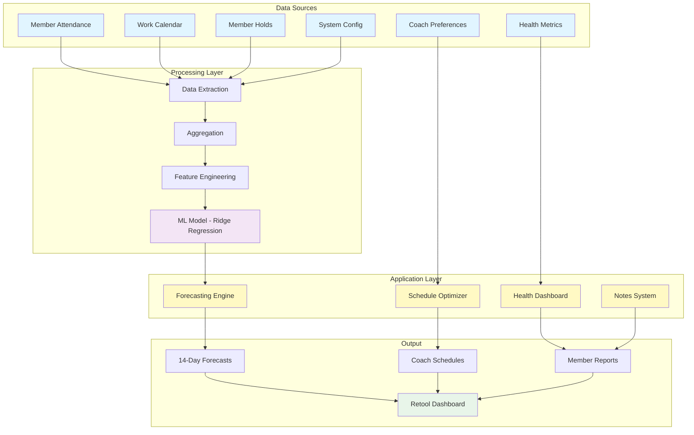
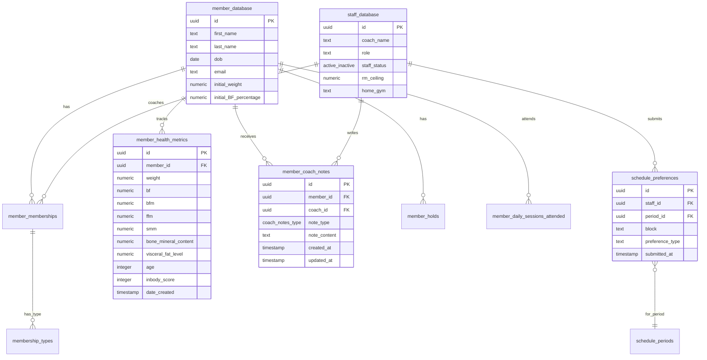
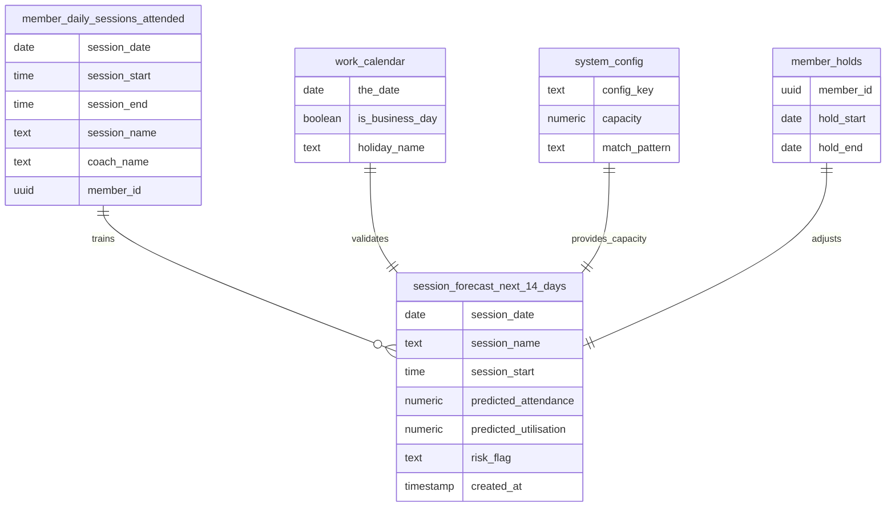
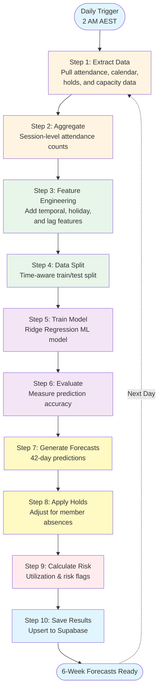
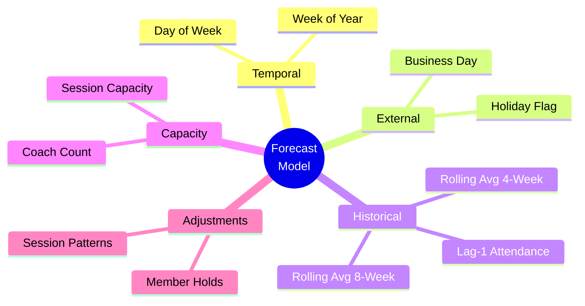
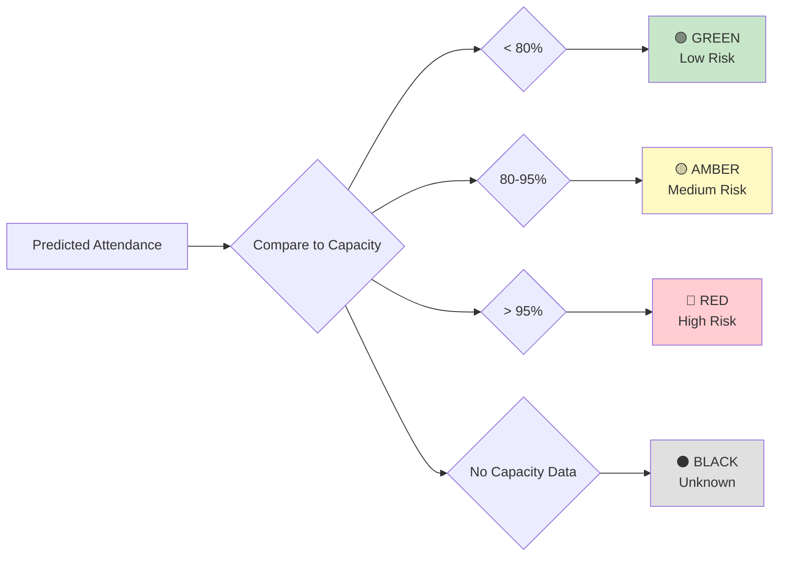

# Schedule Prediction & Management System

A comprehensive gym management and forecasting system that predicts session attendance, manages coach schedules, tracks member health metrics, and facilitates coaching notes.

## 📋 Table of Contents

- [Overview](#overview)
- [System Architecture](#system-architecture)
- [Database Schema](#database-schema)
- [Forecasting Pipeline](#forecasting-pipeline)
- [Setup & Installation](#setup--installation)
- [Usage](#usage)
- [Features](#features)

---

## Overview

This system provides:

1. **Session Attendance Forecasting** - ML-powered predictions for the next 6 weeks
2. **Coach Schedule Management** - Track preferences and hard blocks
3. **Member Health Tracking** - InBody metrics, weight, body fat, etc.
4. **Coaching Notes** - Structured note-taking for member progress
5. **Capacity Planning** - Risk flags and utilization monitoring

---

## System Architecture



---

## Database Schema

### Core Tables Relationship



### Forecasting Pipeline Tables



---

## Forecasting Pipeline

### High-Level Flow



### Model Features



### Risk Flag Calculation



---

## Setup & Installation

### Prerequisites

- Python 3.10+
- Supabase account
- GitHub account (for automated runs)

### Local Installation

```bash
# Clone repository
git clone https://github.com/towshau/schedule_prediction_supply.git
cd schedule_prediction_supply

# Create virtual environment
python -m venv venv
source venv/bin/activate  # Windows: venv\Scripts\activate

# Install dependencies
pip install -r requirements.txt

# Configure environment
cp .env.example .env
# Edit .env with your credentials:
# SUPABASE_URL=your_project_url
# SUPABASE_SERVICE_ROLE_KEY=your_service_key
```

### Database Setup

Run the SQL scripts to create required tables:

```bash
# Core tables
cat sql/create_forecast_table.sql | supabase db execute
cat sql/create_member_cardio_time_trials.sql | supabase db execute

# Enums
cat sql/create_cardio_timetrial_enum.sql | supabase db execute
```

### GitHub Actions Setup

1. Go to repository Settings → Secrets
2. Add secrets:
   - `SUPABASE_URL`
   - `SUPABASE_SERVICE_ROLE_KEY`
3. Workflow runs daily at 2 AM UTC automatically

---

## Usage

### Run Forecast Manually

```bash
python run_forecast.py
```

### Query Forecasts

```python
from src.database import get_supabase_client

client = get_supabase_client()

# Get next 14 days of forecasts
response = client.table('session_forecast_next_14_days')\
    .select('*')\
    .gte('session_date', 'today')\
    .order('session_date')\
    .execute()

forecasts = response.data
```

### Add Coach Notes

```python
# Via Retool or direct SQL
INSERT INTO member_coach_notes (member_id, coach_id, note_type, note_content)
VALUES (
    'member-uuid',
    'coach-uuid', 
    'goal',
    'Wants to hit 95kg squat by March'
);
```

---

## Features

### 1. Session Forecasting

- **42-day predictions** for all session types
- **ML-powered** using Ridge Regression
- **Risk flags** (Green/Amber/Red/Black)
- **Utilization tracking** (capacity %)
- **Member hold adjustments**

### 2. Coach Management

- **Schedule preferences** (HARD blocks, soft preferences)
- **Capacity planning** (RM ceiling tracking)
- **Multi-gym support** (BLIGH, BRIDGE, etc.)
- **Role-based filtering**

### 3. Member Health Tracking

- **InBody metrics** (weight, BF%, muscle mass, etc.)
- **Progress tracking** over time
- **Initial vs current** comparisons
- **Plotly visualizations** in Retool

### 4. Coaching Notes

- **Structured note types** (goal, habits, general, other)
- **Timestamped entries**
- **Coach attribution**
- **Full history tracking**

### 5. Analytics & Reporting

- **View by coach** - member counts, capacity
- **View by member** - health trends, notes
- **Calendar integration** - schedule visualization
- **Export capabilities**

---

## Model Details

### Algorithm: Ridge Regression

- **Type:** Linear regression with L2 regularization
- **Alpha:** 1.0 (prevents overfitting)
- **Training:** Time-aware split (last 30 days = test)
- **Features:** 13 total (temporal + lag + rolling averages)

### Performance Metrics

- **MAE** (Mean Absolute Error) - logged after each run
- **RMSE** (Root Mean Squared Error) - measure of variance
- **R²** (Coefficient of Determination) - model fit quality

### Continuous Improvement

The model retrains daily with:
- ✅ New attendance data
- ✅ Updated member patterns
- ✅ Recent hold information
- ✅ Seasonal adjustments

---

## Project Structure

```
Schedule/
├── README.md                       # This file
├── PIPELINE_FLOW.md               # Detailed pipeline docs
├── requirements.txt               # Python dependencies
├── .env                          # Environment variables (create this)
├── .env.example                  # Template
├── .gitignore
│
├── .github/
│   └── workflows/
│       └── daily_forecast.yml    # Automated daily runs
│
├── sql/
│   ├── create_forecast_table.sql
│   ├── create_member_cardio_time_trials.sql
│   └── create_cardio_timetrial_enum.sql
│
├── src/
│   ├── __init__.py
│   ├── config.py                  # Configuration management
│   ├── database.py                # Supabase operations
│   ├── data_extraction.py         # Data pull from Supabase
│   ├── aggregation.py             # Session-level aggregation
│   ├── feature_engineering.py     # ML feature creation
│   ├── model_training.py          # Ridge regression training
│   ├── forecasting.py             # Prediction generation
│   └── data_loading.py            # Risk flags & capacity
│
└── run_forecast.py                # Main pipeline orchestrator
```

---

## Troubleshooting

### Common Issues

| Issue | Solution |
|-------|----------|
| Missing environment variables | Check `.env` file exists with correct values |
| Database connection fails | Verify Supabase URL and service key |
| Model accuracy poor | Ensure 2-3 months of historical data available |
| Forecast dates missing | Check `work_calendar` has future dates |
| GitHub Actions fail | Verify secrets are set in repository settings |

### Logging

All operations are logged:
```bash
# View logs
tail -f logs/forecast.log

# Or check GitHub Actions logs in the Actions tab
```

---

## Future Enhancements

- [ ] Coach-specific prediction models
- [ ] Seasonal pattern detection
- [ ] Real-time attendance tracking
- [ ] Automated waitlist management
- [ ] Member journey stage forecasting
- [ ] Advanced scheduling optimization
- [ ] Mobile app integration

---

## Contributing

1. Fork the repository
2. Create feature branch (`git checkout -b feature/YourFeature`)
3. Commit changes (`git commit -m 'Add YourFeature'`)
4. Push to branch (`git push origin feature/YourFeature`)
5. Open Pull Request

---

## License

[MIT License](LICENSE)

---

## Support

For issues or questions:
- 📧 Email: [your-email]
- 💬 Slack: [your-slack-channel]
- 📝 Issues: [GitHub Issues](https://github.com/towshau/schedule_prediction_supply/issues)

---

**Built with ❤️ for better gym management**
